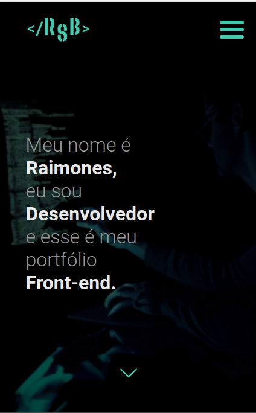
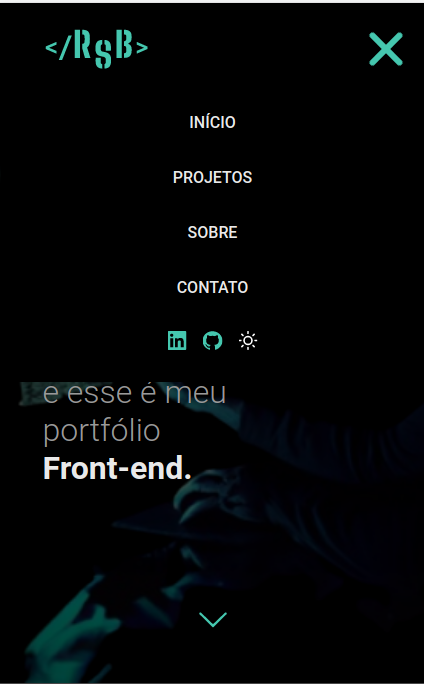

<h1> Portfólio :own</h1>

## Página de divulgação dos meus projetos

----
----

----

## 📲 Responsividade

  
  

----

## 💻 Tecnologias utilizadas
 

  

----

## Legenda
:own - Projeto próprio

----

<a href="https://raimonesbarros.github.io/portfolio/"> 📤 Ir para página 📤 </a>

----
----
