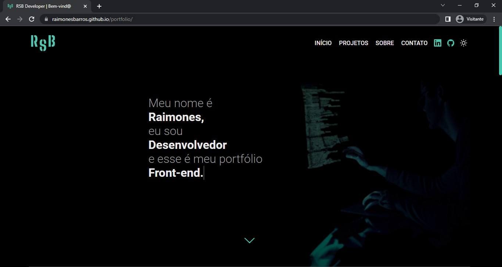

<h1> Portfólio</h1> 

## Página de divulgação dos meus projetos

----
----

----

## 📲 Responsividade

  
  

----

## 💻 Tecnologias utilizadas
 

  

----
----

<a href="https://raimonesbarros.github.io/portfolio/"> 📤 Ir para página 📤 </a>

----
----
